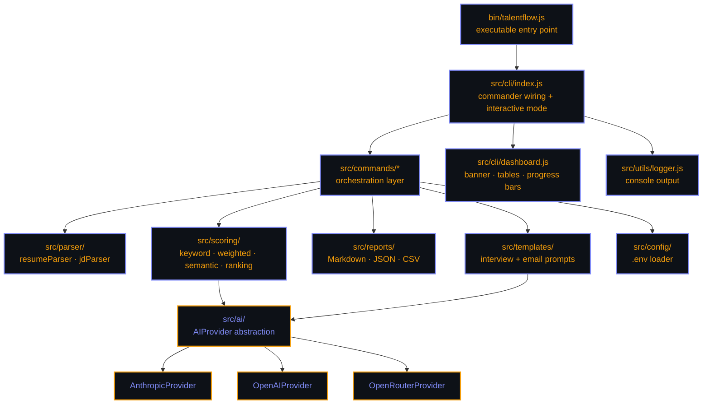
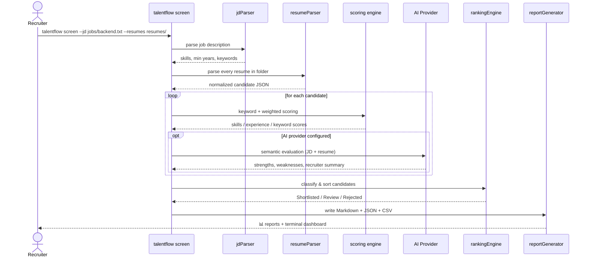
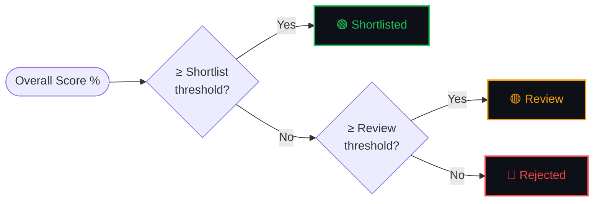
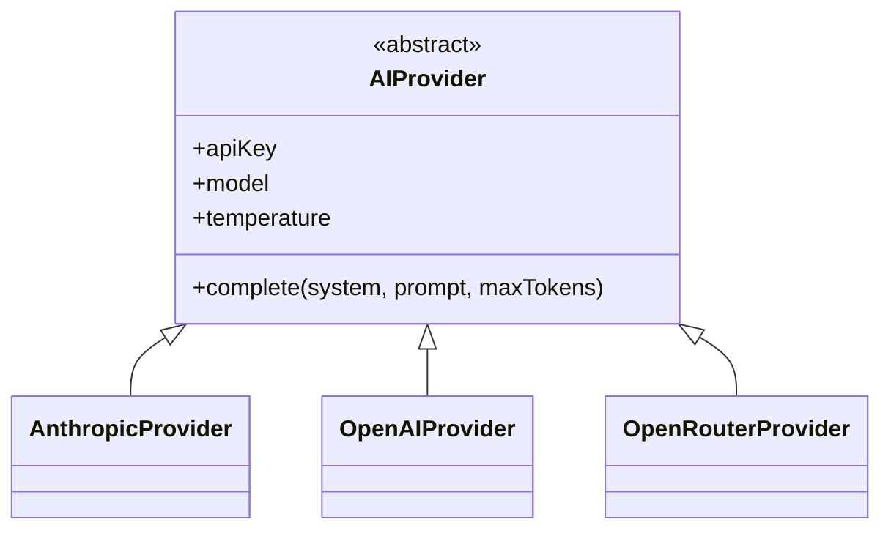
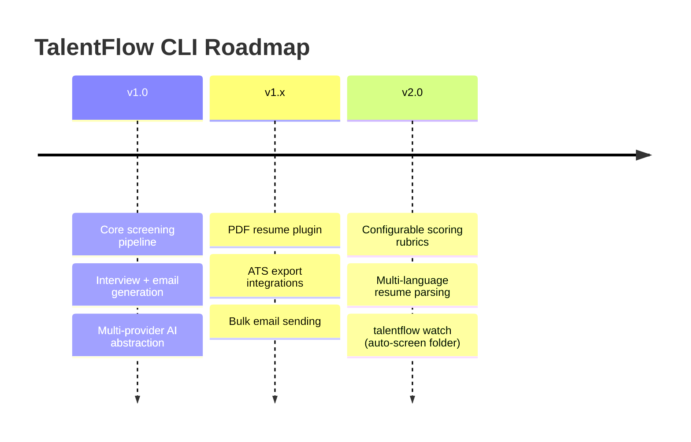

<div align="center">


<a href="https://github.com/SHalimoosavi/talentflow-cli">
  
</a>

<br/>

[](https://github.com/SHalimoosavi/talentflow-cli/actions/workflows/ci.yml)
[](LICENSE)
[](https://nodejs.org)
[](CONTRIBUTING.md)
[](https://termux.dev)
[](https://conventionalcommits.org)

<br/>

**Resume screening · Candidate ranking · Interview prep · Recruiter emails.**
**One CLI. Zero native dependencies. Runs anywhere — including your phone.**

```
━━━━━━━━━━━━━━━━━━━━━━━━━━━━━━━━━━━━━━━━━━━━

  TalentFlow CLI v1.0.0
  AI Recruitment Automation Toolkit

━━━━━━━━━━━━━━━━━━━━━━━━━━━━━━━━━━━━━━━━━━━━

  Candidates Parsed     42
  Shortlisted            9
  Review                 12
  Rejected                21
  Average Match          81%

━━━━━━━━━━━━━━━━━━━━━━━━━━━━━━━━━━━━━━━━━━━━
```

</div>

<br/>

## 📖 Table of contents

<table>
<tr>
<td valign="top" width="33%">

- [🔎 Overview](#-overview)
- [🏗️ Architecture](#️-architecture)
- [⚙️ How it works](#️-how-it-works)
- [✨ Features](#-features)

</td>
<td valign="top" width="33%">

- [📦 Installation](#-installation)
- [🚀 Usage](#-usage)
- [🔧 Configuration](#-configuration)
- [🤖 AI providers](#-ai-providers)

</td>
<td valign="top" width="33%">

- [📊 Output formats](#-output-formats)
- [🗺️ Roadmap](#️-roadmap)
- [🤝 Contributing](#-contributing)
- [❓ FAQ](#-faq)
- [👤 Author](#-author)

</td>
</tr>
</table>

<br/>

## 🔎 Overview

> TalentFlow CLI is a recruiter's toolkit that lives entirely in the terminal.

Point it at a job description and a folder of resumes, and it will **parse,
score, rank, and report** on every candidate — then generate tailored
**interview kits** and **recruiter emails** for the ones you shortlist.

It's built to be **dependency-light by design**: no PDF megalibraries, no
native compilation, no platform-specific code. That means it runs exactly the
same way on a recruiter's Windows laptop, a hiring manager's Mac, a CI
pipeline on Linux, or a phone running **Termux**.

<div align="center">

| 🪶 Lightweight |      🌍 Cross-platform       |         🔌 Pluggable AI         |     🧪 Fully tested     |
| :------------: | :--------------------------: | :-----------------------------: | :---------------------: |
| No native deps | Win / Linux / macOS / Termux | Anthropic · OpenAI · OpenRouter | `node:test` + CI matrix |

</div>

<br/>

## 🏗️ Architecture

TalentFlow separates **CLI/UX code** from **business logic** (parsers,
scoring, AI providers, reports) so every piece is independently testable and
reusable as a library (see [`index.js`](index.js)). Full breakdown in
[`docs/architecture.md`](docs/architecture.md).



```
talentflow-cli/
├── bin/                  # CLI executable
├── src/
│   ├── cli/                # commander wiring, interactive mode, dashboard UI
│   ├── commands/            # one file per `talentflow <command>`
│   ├── parser/                # resume + job description parsing
│   ├── scoring/                 # keyword / weighted / semantic scoring + ranking
│   ├── ai/                        # AIProvider abstraction (Anthropic/OpenAI/OpenRouter)
│   ├── reports/                     # Markdown / JSON / CSV report generation
│   ├── templates/                     # interview + email prompt/fallback templates
│   ├── utils/                           # fs, text, and logging helpers
│   └── config/                            # .env-driven configuration loader
├── examples/, jobs/, resumes/, output/   # sample data + generated output
├── tests/                # node:test unit tests
└── docs/                 # architecture + plugin docs
```

<br/>

## ⚙️ How it works

The full `talentflow screen` pipeline, end to end:



Candidate classification logic:



<br/>

## ✨ Features

<table>
<tr>
<td width="50%" valign="top">

### 🧠 Intelligent resume parser

Reads `.txt` / `.md` resumes and extracts name, email, phone, skills,
experience, education, certifications, projects, and keywords into
normalized JSON. PDF support is a pluggable add-on — see
[`docs/plugins.md`](docs/plugins.md) — so the core stays light.

### 🎯 AI resume matching engine

Every candidate is scored three ways: **keyword overlap**, **weighted
skills/experience blend**, and optional **AI semantic evaluation** with
strengths, weaknesses, and a recruiter summary.

### 🏆 Candidate ranking engine

Classifies candidates into **Shortlisted / Review / Rejected** with
configurable thresholds, exported as CSV, JSON, and Markdown.

</td>
<td width="50%" valign="top">

### 🗣️ AI interview generator

Generates technical, behavioural, culture-fit, resume-specific, and
follow-up questions for every shortlisted candidate, saved as Markdown.

### ✉️ AI email generator

Drafts interview invitations, rejections, info requests, final-round
invites, and offer-prep emails — in formal, friendly, startup, or corporate
tone.

### 📊 Beautiful terminal dashboard

ASCII banner, colored progress bars, status badges, and a ranked candidate
table — powered by `chalk` + `cli-table3`.

</td>
</tr>
</table>

<div align="center">

**💻 Interactive + scriptable** — run `talentflow` with no args for a guided
session, or run any command directly for scripting/CI use.

</div>

<br/>

## 📦 Installation

**Requirements:** [Node.js 22+](https://nodejs.org)

<details open>
<summary><b>🪟 Windows (PowerShell or CMD)</b></summary>

```powershell
git clone https://github.com/SHalimoosavi/talentflow-cli.git
cd talentflow-cli
npm install
npm link      # optional: makes `talentflow` available globally
```

</details>

<details>
<summary><b>🐧 Linux / 🍎 macOS</b></summary>

```bash
git clone https://github.com/SHalimoosavi/talentflow-cli.git
cd talentflow-cli
npm install
npm link      # optional: makes `talentflow` available globally
```

</details>

<details>
<summary><b>📱 Android (Termux)</b></summary>

```bash
pkg update && pkg install nodejs-lts git -y
git clone https://github.com/SHalimoosavi/talentflow-cli.git
cd talentflow-cli
npm install
node bin/talentflow.js doctor   # sanity-check your environment
```

> ⚠️ Always clone/install inside Termux's home filesystem (`~/`), **not**
> `~/storage/...` (shared Android storage). Shared storage doesn't support
> symlinks, which `npm install` needs. `npm link` may also need extra
> permissions in Termux — running via `node bin/talentflow.js <command>`
> always works as a fallback.

</details>

<br/>

## 🚀 Usage

### Interactive mode

```bash
talentflow
```

Walks you through screening, interview generation, emails, and configuration
with simple prompts — no flags required.

### Direct commands

```bash
# Parse resumes into normalized JSON
talentflow parse --resumes resumes/

# Full screening pipeline: parse + score + rank + report
talentflow screen --jd jobs/backend.txt --resumes resumes/

# Screen without AI (keyword/weighted scoring only)
talentflow screen --jd jobs/backend.txt --resumes resumes/ --no-ai

# Generate interview kits for shortlisted candidates
talentflow interview --jd jobs/backend.txt

# Regenerate reports from an existing candidates.json
talentflow reports --jd jobs/backend.txt

# Draft interview-invitation emails for shortlisted candidates
talentflow emails --jd jobs/backend.txt --type interview-invitation \
  --tone friendly --status Shortlisted --company "Acme Inc."

# Inspect or initialize configuration
talentflow config
talentflow config --init

# Check your environment for common issues
talentflow doctor
```

> Run `talentflow --help` or `talentflow <command> --help` for the full flag
> reference.

<br/>

## 🔧 Configuration

TalentFlow reads configuration from environment variables / a local `.env`
file — **never** from hardcoded values.

```bash
cp .env.example .env
```

| Variable                         | Description                                  | Default           |
| -------------------------------- | -------------------------------------------- | ----------------- |
| `AI_PROVIDER`                    | `anthropic` \| `openai` \| `openrouter`      | `anthropic`       |
| `MODEL`                          | Model name for the selected provider         | provider-specific |
| `TEMPERATURE`                    | Sampling temperature (0–1)                   | `0.3`             |
| `OPENAI_API_KEY`                 | API key for OpenAI                           | —                 |
| `ANTHROPIC_API_KEY`              | API key for Anthropic                        | —                 |
| `OPENROUTER_API_KEY`             | API key for OpenRouter                       | —                 |
| `TALENTFLOW_SKILLS_WEIGHT`       | Weight for skills match in the overall score | `0.5`             |
| `TALENTFLOW_EXPERIENCE_WEIGHT`   | Weight for experience match                  | `0.3`             |
| `TALENTFLOW_KEYWORD_WEIGHT`      | Weight for keyword overlap                   | `0.2`             |
| `TALENTFLOW_SHORTLIST_THRESHOLD` | Minimum score (%) to shortlist               | `75`              |
| `TALENTFLOW_REVIEW_THRESHOLD`    | Minimum score (%) for manual review          | `50`              |
| `TALENTFLOW_RESUMES_DIR`         | Default resumes folder                       | `resumes`         |
| `TALENTFLOW_JOBS_DIR`            | Default job descriptions folder              | `jobs`            |
| `TALENTFLOW_OUTPUT_DIR`          | Default output folder                        | `output`          |
| `TALENTFLOW_USE_AI`              | Globally enable/disable AI features          | `true`            |

> 💡 No AI key configured? TalentFlow automatically falls back to
> keyword + weighted scoring and template-based interview/email generation —
> every feature still works, just without the semantic layer.

<br/>

## 🤖 AI providers

TalentFlow ships with an `AIProvider` abstraction so switching providers is a
one-line `.env` change:

```env
AI_PROVIDER=anthropic   # or: openai, openrouter
```



| Provider   | Env var              | Notes                              |
| ---------- | -------------------- | ---------------------------------- |
| Anthropic  | `ANTHROPIC_API_KEY`  | Default provider                   |
| OpenAI     | `OPENAI_API_KEY`     |                                    |
| OpenRouter | `OPENROUTER_API_KEY` | Access many models through one key |

Adding a new provider takes **two files** — see
[CONTRIBUTING.md](CONTRIBUTING.md#adding-a-new-ai-provider).

<br/>

## 📊 Output formats

Every `talentflow screen` run writes to your output directory (default
`output/`):

```
output/
├── candidates.json      # full ranked candidate data
├── report.md             # executive summary, ranking table, skill gaps
├── report.json             # machine-readable report
├── report.csv                # spreadsheet-friendly ranking
├── interviews/*.md             # per-candidate interview kits (after `interview`)
└── emails/*.md                   # per-candidate email drafts (after `emails`)
```

Each report includes: candidate ranking, score breakdown
(skills/experience/keywords), an executive summary, skill gap analysis, and a
hiring recommendation.

<br/>

## 🗺️ Roadmap



- [ ] First-party PDF resume plugin (`talentflow plugin add pdf`)
- [ ] Applicant Tracking System (ATS) export integrations
- [ ] Bulk email sending via SMTP/API connectors
- [ ] Configurable scoring rubrics per role template
- [ ] Multi-language resume parsing
- [ ] `talentflow watch` — auto-screen new resumes dropped into a folder

Have an idea? Open a
[feature request](.github/ISSUE_TEMPLATE/feature_request.md).

<br/>

## 🤝 Contributing

Contributions are welcome! Please read [CONTRIBUTING.md](CONTRIBUTING.md) for
the development workflow, architecture principles, and PR checklist. This
project follows the [Contributor Covenant](CODE_OF_CONDUCT.md).

<div align="center">

[](https://github.com/SHalimoosavi/talentflow-cli/graphs/contributors)
[](https://github.com/SHalimoosavi/talentflow-cli/issues)
[](https://github.com/SHalimoosavi/talentflow-cli/stargazers)

</div>

<br/>

## ❓ FAQ

<details>
<summary><b>Does TalentFlow send my resumes to the cloud?</b></summary>
<br/>
Only if you configure an AI provider and don't pass <code>--no-ai</code>.
Parsing, scoring (keyword/weighted), and reporting all run 100% locally
regardless. Semantic scoring and AI-generated interview kits/emails send the
relevant resume/JD text to your configured provider's API.
</details>

<details>
<summary><b>Can I use TalentFlow without an API key?</b></summary>
<br/>
Yes. Every feature has a non-AI fallback: keyword/weighted scoring instead of
semantic scoring, and template-based interview kits/emails instead of
AI-generated ones.
</details>

<details>
<summary><b>Why doesn't it support PDF resumes out of the box?</b></summary>
<br/>
To stay dependency-light and Termux-compatible. See
<a href="docs/plugins.md"><code>docs/plugins.md</code></a> for the plugin
pattern and how to add PDF support yourself, or export resumes to
<code>.txt</code>/<code>.md</code> first.
</details>

<details>
<summary><b>Does this work on my Android phone?</b></summary>
<br/>
Yes — TalentFlow is built and tested to run inside
<a href="https://termux.dev">Termux</a> with no native dependencies. Just be
sure to install it inside Termux's home filesystem, not shared Android
storage.
</details>

<details>
<summary><b>How is the overall score calculated?</b></summary>
<br/>
A weighted blend of skills match, experience match, and keyword overlap
(weights configurable via <code>.env</code>). If AI scoring is enabled, the
semantic score is averaged in as well.
</details>

<br/>

## 👤 Author

<div align="center">


### **Syed Ali Hasan Moosavi**

Founder & Managing Director — **SAYANJALI NEXUS PRIVATE LIMITED**
_Building AI automation systems, custom SaaS platforms, open-source tools, and enterprise compliance solutions — entirely from Android via Termux._

[](https://github.com/SHalimoosavi)
[](mailto:cto@sayanjalinexus.com)
[](mailto:cto@sayanjalinexus.com)

</div>

<br/>

## 📄 License

[MIT](LICENSE) © 2026 SAYANJALI NEXUS PRIVATE LIMITED

<br/>

<div align="center">


**If TalentFlow CLI saves your team time, consider ⭐ starring the repo.**

</div>
